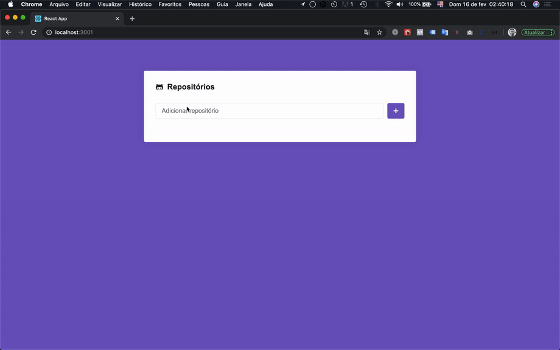

:octocat: Add GitHub repository, details and issues.



# Technologies Used

* React
* Axios
* prop-types
* styled-components
* ESLint

# How to install and Running Locally

**- 1º Step: Using Yarn**

```sh
yarn install
```

2º step: To run the aplication in deveoper mode

```sh
yarn star
```

**- 3º Step:** <br>
Open [http://localhost:3000](http://localhost:3000) to view it in the browser.


## Credits

- [Diego Fernandes](https://github.com/diego3g)(CTO)
